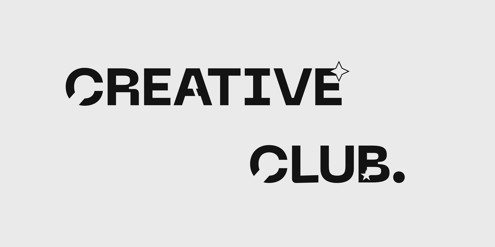

# GSAP Animation Collection

This repository contains a collection of animations created using [GSAP (GreenSock Animation Platform)](https://greensock.com/gsap/). The project serves as a reference and documentation for various examples of interactive animations that can be used or modified as needed.

Feel free to use and explore the animations available in this project.

## Credits

Some image assets used in this project are sourced from [Freepik](https://www.freepik.com/) and [Unsplash](https://unsplash.com/). Several font styles are also taken from [DaFont](https://www.dafont.com/), [FreeFonts.co](https://www.freefonts.co), and [FreeFonts.io](https://freefonts.io).
